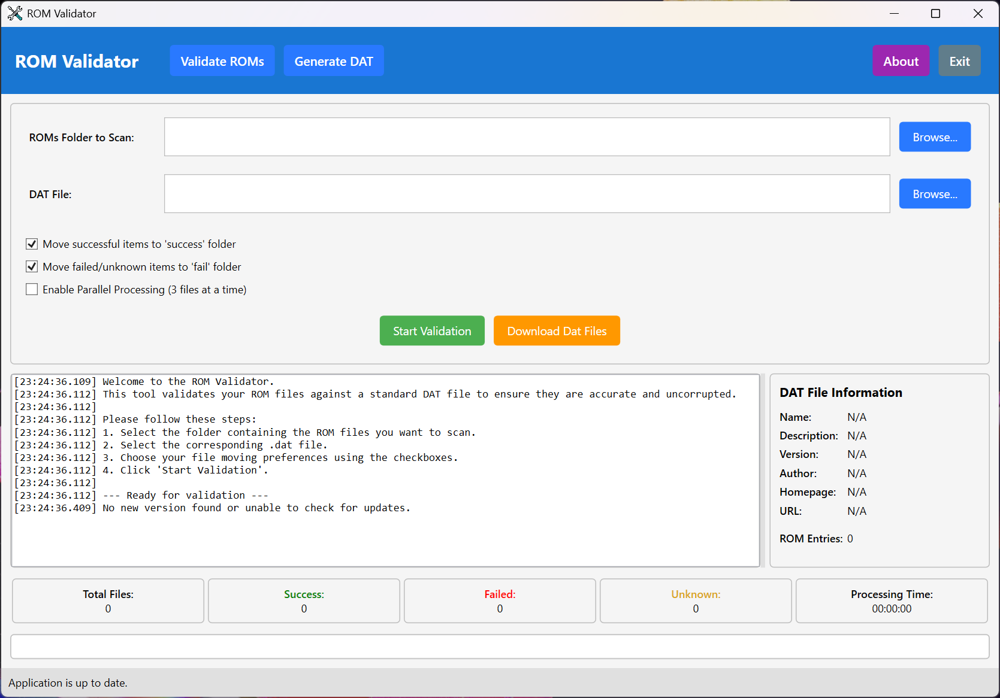

# ROM Validator

A powerful Windows desktop utility for both validating ROM files against No-Intro DAT files and generating new, compliant DAT files from your collection.

## ⭐ Support This Project

If you find ROM Validator useful, please consider:

-   **Giving us a star** ⭐ on GitHub to help others discover this project
-   **Making a donation** at [https://www.purelogiccode.com/donate](https://www.purelogiccode.com/donate) to support continued development

Your support helps keep this project alive and enables us to add new features and improvements!

## Overview

The ROM Validator is a Windows application that allows users to validate their ROM collection against DAT files. It checks each file's size and hash (SHA1, MD5, or CRC32) to verify authenticity and integrity. The application can automatically organize files based on validation results for easy management of ROM collections.

## Features

-   **DAT File Support**: Parses DAT files (XML format) to extract ROM validation criteria
-   **Multi-Hash Validation**: Supports SHA1, MD5, and CRC32 hash verification
-   **Batch Processing**: Validates all ROM files in a folder in a single operation
-   **Automatic Organization**: Moves files to `_success` or `_fail` folders based on validation results
-   **Parallel Processing**: Uses multi-threading for faster validation of large collections
-   **Detailed Logging**: Provides real-time validation results with timestamps
-   **Statistics Tracking**: Displays counts of successful, failed, and unknown files
-   **Progress Monitoring**: Shows real-time progress of file validation with a progress bar and current file name.
-   **Status Bar**: Provides concise, real-time application status messages at the bottom of the window.

## 🚀 What's New in Release 2.0 (2025-10-01)

-   **Codebase Refactor**: Significant internal refactoring for easier future updates and improved code readability.
-   **Enhanced DAT File Handling**: Added pre-validation for DAT files to ensure No-Intro XML format compatibility before processing, preventing errors early.
-   **Robust File Operations**: Enhanced file move operations with retry logic and better handling of locked files, improving reliability.
-   **User Interface Refresh**: Redesigned interface with custom button styles and color-coded actions for a more intuitive experience.
-   **Streamlined Error Handling**: Improved overall error handling across the application.

## Supported File Formats

-   All ROM file formats supported by DAT specifications
-   Compatible with DAT files from and similar preservation projects

## Requirements

-   Windows 7 or later
-   [.NET 9.0 Runtime](https://dotnet.microsoft.com/download/dotnet/9.0)

## Installation

1.  Download the latest release ZIP file
2.  Extract contents to a folder of your choice
3.  Run `RomValidator.exe`

## Usage

1.  **Select ROMs Folder**: Click "Browse" next to "ROMs Folder to Scan" to select your ROMs directory
2.  **Select DAT File**: Click "Browse" next to "DAT File" to select your DAT file
3.  **Configure Options**:
    -   Check "Move successful items" to automatically move valid ROMs to `_success`
    -   Check "Move failed/unknown items" to move invalid ROMs to `_fail`
    -   Check "Enable Parallel Processing" for faster validation (processes 3 files concurrently).
4.  **Start Validation**: Click "Start Validation" to begin the process
5.  **Review Results**: Check the log window, statistics panel, and status bar for validation results and application status.

## Validation Process

The validator performs these checks for each ROM file:
1.  **Presence Check**: Verifies the file exists in the DAT database
2.  **Size Check**: Compares actual file size with expected size
3.  **Hash Verification**: Validates SHA1, MD5, or CRC32 hashes (in order of priority)

Files are categorized as:
-   ✅ **Success**: Matches all criteria in DAT file
-   ❌ **Failed**: Fails size or hash check
-   ❓ **Unknown**: Not found in DAT file

## Why Validate ROMs?

-   **Preservation**: Ensures ROMs are exact copies of original media
-   **Compatibility**: Guarantees files will work correctly with emulators
-   **Organization**: Identifies corrupted or modified files in your collection
-   **Verification**: Confirms you have authentic versions for preservation projects

## Troubleshooting

-   **DAT File Issues**: Ensure you're using a valid XML DAT file
-   **File Access Errors**: Run as Administrator if encountering permission issues
-   **Validation Errors**: Check log details for specific failure reasons
-   **Slow Performance**: Reduce system load during validation for better performance

## Acknowledgements

-   Uses [System.IO.Hashing](https://www.nuget.org/packages/System.IO.Hashing) for CRC32 computation
-   Inspired by ROM preservation efforts of the community
