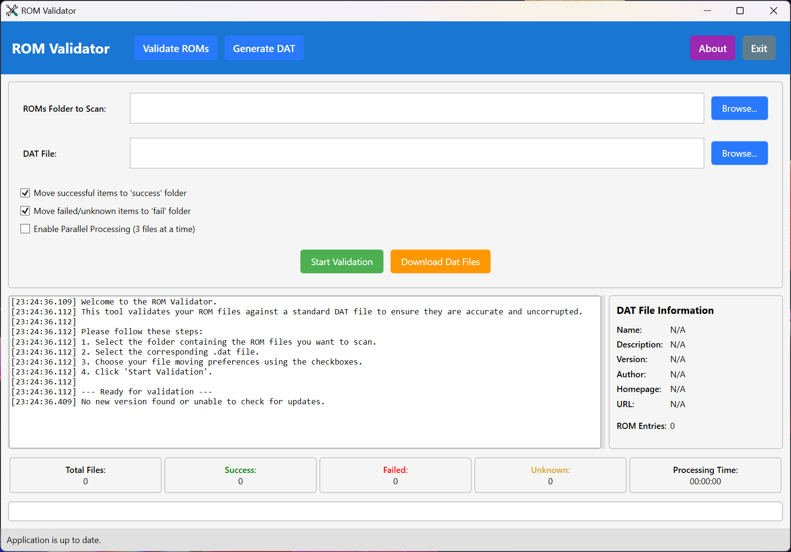
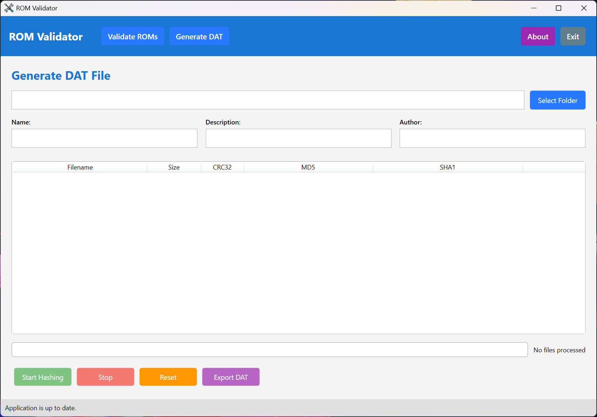

# ROM Validator

**ROM Validator** is a high-performance Windows desktop utility designed for ROM collection management and digital preservation. It provides a streamlined workflow for validating local ROM files against industry-standard No-Intro DAT specifications and generating new, compliant DAT files from existing collections.

## 🚀 Key Features

### 🔍 Advanced Validation
-   **Multi-Hash Verification**: Validates file integrity using CRC32, MD5, SHA1, and SHA256 checksums.
-   **No-Intro Integration**: Native support for No-Intro XML DAT formats (currently the only supported format).
-   **Archive Support**: Deep-scans within compressed archives (ZIP, 7z, RAR, etc.) without manual extraction, powered by SevenZipSharp.
-   **Smart File Renaming**: Automatically renames files when hash matches but filename differs, ensuring your collection matches the DAT exactly. Supports renaming files inside ZIP and 7z archives.

### 📂 Collection Management
-   **Automated Organization**: Automatically sorts files into `_success` or `_fail` directories based on validation results.
-   **Flexible File Handling**: Optional permanent deletion of failed/unknown files with safety confirmations.
-   **DAT Generation**: Create No-Intro compliant DAT files from any folder, complete with custom metadata (Author, Version, Description).
-   **DAT Format Validation**: Automatic detection of incompatible file formats (ZIP, HTML, ClrMamePro, MAME) with clear error messages. Note: This version exclusively supports No-Intro XML DATs.
-   **7z Archive Creation**: Repackage renamed ROM files into new 7z archives with LZMA2 compression.
-   **Real-time Logging**: Detailed, timestamped logs for every operation, including specific reasons for validation failures.

### 💻 User Experience
-   **Modern WPF Interface**: A clean, responsive UI with progress monitoring, statistical breakdowns, and centralized styling.
-   **Async Architecture**: Non-blocking I/O operations for improved responsiveness during large scans.
-   **Update Notifications**: Integrated GitHub version checking with automatic notifications when new releases are available.
-   **Automatic Bug Reporting**: Enhanced service with structured error reporting, exception context capture, and intelligent noise reduction for faster issue resolution.
-   **Centralized Exception Handling**: New `ExceptionHandler` service ensures consistent error handling across the application.

---

## 🛠 Requirements

-   **Operating System**: Windows 10 (version 1809) or later / Windows 11.
-   **Runtime**: [.NET 10.0 Desktop Runtime](https://dotnet.microsoft.com/download/dotnet/10.0).
-   **Architecture**: x64 or ARM64.

---

## 📥 Installation

1.  Navigate to the [Releases](https://github.com/drpetersonfernandes/RomValidator/releases) page.
2.  Download the latest `RomValidator.zip`.
3.  Extract the contents to a permanent folder.
4.  Launch `RomValidator.exe`.

---

## 📖 Usage Guide

### Validating ROMs
1.  **Select Source**: Choose the folder containing your ROM files.
2.  **Load DAT**: Select a compatible No-Intro XML DAT file.
3.  **Configure Options**:
    -   Toggle "Move successful items" to organize valid ROMs into a `_success` folder.
    -   Toggle "Move failed/unknown items" to organize invalid ROMs into a `_fail` folder.
    -   Enable "Automatically rename files" to match DAT entries when hashes match but filenames differ.
    -   ⚠️ **Caution**: The "Permanently delete failed files" option cannot be undone.
4.  **Execute**: Click **Start Validation**. The application will categorize files as ✅ **Success**, ❌ **Failed**, or ❓ **Unknown**.

### Generating DATs
1.  Switch to the **Generate DAT** tab.
2.  **Select Folder**: Choose the directory containing the files you wish to catalog.
3.  **Metadata**: Enter the Name, Description, and Author for the DAT header.
4.  **Process**: Click **Start Hashing**.
5.  **Export**: Once complete, click **Export DAT** to save the XML file.

---

## 🤝 Support & Contribution

If you find this tool helpful for your preservation projects, please consider:

-   **Starring the project** on GitHub to increase visibility.
-   **Reporting Bugs**: Use the built-in reporting tool or open a GitHub Issue.
-   **Donations**: Support continued development at [purelogiccode.com/donate](https://www.purelogiccode.com/donate).

---

## 📜 License

This project is licensed under the **GNU General Public License v3.0**. See the [LICENSE.txt](LICENSE.txt) file for full details.

Developed by **Pure Logic Code**  
[www.purelogiccode.com](http://www.purelogiccode.com)